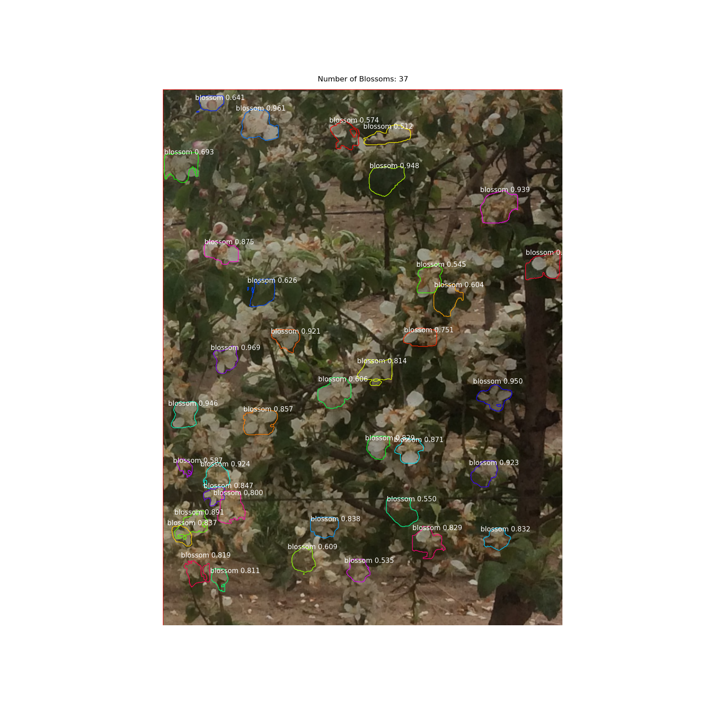

# Mask R-CNN for Detecting and Counting Blossoms

This is an implementation of [Mask R-CNN](https://arxiv.org/abs/1703.06870) on Python 3, Keras, and TensorFlow created by [matterport](https://github.com/matterport/Mask_RCNN).

This repository is part of a computer vision project at Northwest Nazarene University involving counting blossoms and predicting fruit yields.



## Installation
These instructions assume python has already been setup, for instruction on setting up python click [here](assets/python_setup.txt).

1. Clone this repository
   ```bash
   git clone https://github.com/aborger/Mask_RCNN.git
   ```
2. Install dependencies
   ```bash
   pip3 install -r requirements.txt
   ```
3. Run setup from the repository root directory
    ```bash
    python3 setup.py install
    ``` 
3. Download pre-trained COCO weights (mask_rcnn_coco.h5) from the [releases page](https://github.com/matterport/Mask_RCNN/releases).

# Getting Started
To begin download training, validation, and testing images and annotations into the dataset folder.

* Each set of images should be located in their own folder named 'train', 'test', and 'val'
    
* The training and validation sets should contain image annotations in a .json file named 'via_region_data'
    
* Image annotations can be completed using the [VGG Image annotator](https://www.robots.ox.ac.uk/~vgg/software/via/via_demo.html)
    
* Configurations can be found in the configuration class at line 59 in '/blossoms/blossom.py'.
## Training
### Training can be completed with the following options:
* Train a new model starting from pre-trained coco weights:
    ```batch
    python3 blossom.py train --weights=coco
    ```
* Train a new model starting from the last trained model:
    ```batch
    python3 blossom.py train --weights=last
    ```
* Train a new model from a previously trained model:
    ```batch
    python3 blossom.py train --weights=/path/to/weights.h5
    ```
* The path to the dataset can be changed if necessary (Although it is set to 'datasets/blossom' by default):
    ```batch
    python3 blossom.py train --weights=weights_option --dataset=/path/to/dataset/directory/
    ```
## Evaluating
### The evaluation command can be used to test the results after training.
The results will be placed in 'Mask_RCNN/results/blossoms/'.
The options are as follows:
* Evaluate the last trained model:
    ```batch
    python3 blossom.py eval --weights=last
    ```
* Evaluate a saved model:
    ```batch
    python3 blossom.py eval --weights=/path/to/weights.h5
    ```
* Images to be evaluated should be placed in the 'datasets/blossom/test/' folder but there is an option to select a different folder:
    ```batch
    python3 blossom.py eval --weights=weights_option --dataset=/path/to/dataset/directory/ --subset=/name/of/directory/inside/dataset/
## Counting Blossoms
### Using the counting blossoms option will create a .csv file containing the number of blossoms for each image.
This option will use images from the test folder or other specified folder using the --dataset and --subset combo.
Results will be placed in the 'Mask_RCNN/results/blossoms/' directory.
The commands for counting are as follows:
* Count blossoms from last trained model:
    ```batch
    python3 blossom.py count --weights=last
    ```
* Count blossoms from a saved model:
    ```batch
    python3 blossom.py count --weights=/path/to/weights.h5
    ```
* Count blossoms using images from a specified folder other than 'Mask_RCNN/datasets/'
    ```batch
    python3 blossom.py count --weights=weights_option --dataset=/path/to/dataset/directory/ --subset=/name/of/directory/inside/dataset/
    ```
    
## Citation
```
@misc{matterport_maskrcnn_2017,
  title={Mask R-CNN for object detection and instance segmentation on Keras and TensorFlow},
  author={Waleed Abdulla},
  year={2017},
  publisher={Github},
  journal={GitHub repository},
  howpublished={\url{https://github.com/matterport/Mask_RCNN}},
}
```
